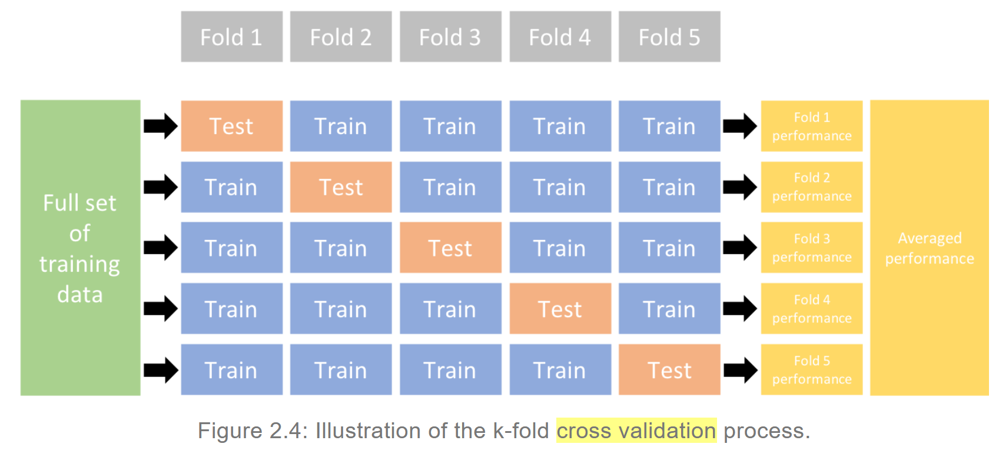

```{r setup, include=FALSE}
options(htmltools.dir.version = FALSE)
```

# LASSO review

.footnote[
[1] [Tibshirani R. Regression shrinkage and selection via the LASSO, 1995. JR Stat Soc B 58:1 267-288.](https://www.jstor.org/stable/2346178)<br>
[2] [Friedman J, et al. Regularization paths for generalized linear models via coordinate descent](https://www.ncbi.nlm.nih.gov/pmc/articles/PMC2929880/), 2010. J Stat Soft, 33:1.
]

--

* Data: $(\mathbf{x}_i, y_i)$ where $\mathbf{x}_i = (x_{i1}, \ldots, x_{ip})'$ are the predictor values;  $y_i$ are the (independent) response values; and $i = 1, \ldots, n$.

--

* Let $\hat{\beta}_0 \in \mathbb{R}$ and $\hat{\boldsymbol{\beta}} = \left( \hat{\beta}_1, \ldots, \hat{\beta}_n \right)'$, the LASSO estimator is

$$\left(\hat{\beta}_0, \hat{\boldsymbol{\beta}}\right) = \underset{\beta_0, \boldsymbol{\beta}}{\operatorname{arg min}} \left\{ \sum_{i=1}^n \left( y_i - \beta_0 - \mathbf{x}_i'\boldsymbol{\beta} \right)^2 \right\} \quad \mathrm{s.t.} \ \sum_{j=1}^p \left| \beta_j \right| \leq t,$$

--

* or equivalently,

$$\left(\hat{\beta}_0, \hat{\boldsymbol{\beta}}\right) = \underset{\beta_0, \boldsymbol{\beta}}{\operatorname{arg min}} \left\{ \sum_{i=1}^n \left( y_i - \beta_0 - \mathbf{x}_i'\boldsymbol{\beta} \right)^2 + \lambda\sum_{j=1}^p \left| \beta_j \right| \right\}.$$

---
class: middle

# Some issues with LASSO and what I'll be talking about today

---
class: inverse, center, middle

# Elastic net

---

# Motivation

.footnote[
[1] [Tibshirani R, 1995. JR Stat Soc B, 58:1 267-288](https://www.jstor.org/stable/2346178).<br>
[3] [Zou H & Hastie T, Regularization and variable selection via the elastic net, 2005. JR Stat Soc B, 67:2 301-320](https://www.jstor.org/stable/3647580).
]

--
* Ridge regression and LASSO both perform well under different circumstances. In particular, ridge seems (empirically) to always win if many variables are correlated.

--

* Why? LASSO **tends to select only one of a set of correlated predictors.** The choice is unstable under small perturbations.

--

* LASSO can only select $n$ predictors (bad when $p \gg n$).

--

* **Solution**: combine L1 penalty of LASSO with L2 penalty of ridge.

--

* As an added benefit, elastic net also tends to be at worst equal with LASSO in terms of prediction error.

---
# Naive loss function

--

* We can combine the two penalty terms to write a new loss function:

$$\left(\hat{\beta_0}, \hat{\boldsymbol{\beta}}\right) = \underset{\beta_0, \boldsymbol{\beta}}{\operatorname{arg min}} \left\{ \sum_{i=1}^n \left( y_i - \beta_0 - \mathbf{x_i}'\boldsymbol{\beta} \right)^2 + \lambda_1 \sum_{j=1}^p \left| \beta_j \right| + \lambda_2 \sum_{j=1}^p \beta_j^2 \right\}.$$

* Zou and Hastie use the matrix notation. But this is equivalent.

--

* Let's reparametrize the penalty term: let $\alpha = \frac{\lambda_2}{\lambda_1 + \lambda_2}$. Then we can write

$$\left(\hat{\beta_0}, \hat{\boldsymbol{\beta}}\right) = \underset{\beta_0, \boldsymbol{\beta}}{\operatorname{arg min}} \left\{ \sum_{i=1}^n \left( y_i - \beta_0 - \mathbf{x_i}'\boldsymbol{\beta} \right)^2 + \lambda P\left(\alpha, \boldsymbol\beta\right) \right\}.$$
* Here, $P(\alpha, \boldsymbol{\beta}) = (1 - \alpha)\sum_{j=1}^p |\beta_j| + \alpha\sum_{j=1}^p \beta_j^2$ and $\lambda \in \mathbb{R}$.

---

# Geometry (Tibshirani 1996)

 

---

# Geometry (Zou & Hastie 2005)


---

### Theoretical advantages of this loss function:

* The modified penalty allows for a **grouping effect**.
* Elastic net tends to include **all predictors in a highly correlated subset**, and then continuously shrinks the coefficients.

--

### Empirical concerns:

* Hastie and Zou suggest that this naive loss function appears to perform badly if $\alpha$ is far from 0 (LASSO) or 1 (ridge).

--

* They provide some empirical evidence of this, but not much. They suggest this is due to "double shrinkage".

--

* Suggestion is to rescale solution by a factor of $1 + \lambda_2 = 1 + \lambda(1-\alpha)$.

---

# Maybe naive is fine, actually?  ¯\\_(ツ)_/¯

.footnote[

[4] [Meinshausen N, Relaxed lasso, 2007. Comp Stat & Data Analysis, 52:1, 374-393.](https://doi.org/10.1016/j.csda.2006.12.019)

[5] https://glmnet.stanford.edu/articles/relax.html 

]

* According to [this Cross Validated post](https://stats.stackexchange.com/questions/326427/why-does-glmnet-use-naive-elastic-net-from-the-zou-hastie-original-paper), Hastie now recommends the **relaxed LASSO** approach instead.

--

* In the original paper describing the relaxed LASSO [4], the relaxed LASSO estimator is estimated from running LASSO twice in a row: once on all predictors, and again on the subset of included predictors (with a new penalty term).

--

* In Hastie's `glmnet` package [5] he uses this relaxation method: let $\hat{\boldsymbol\eta}_\lambda$ be the fitted linear predictor with penalty $\lambda$, and let $\tilde{\boldsymbol\eta}_\lambda$ be the OLS linear predictor using **only the variables from the active set.** <br>

* The rescaled linear predictor is then

$$\tilde{\boldsymbol\eta}_{\gamma, \lambda} = (1 - \gamma)\tilde{\boldsymbol\eta}_\lambda + \gamma \hat{\boldsymbol\eta}_\lambda.$$
---
# Practical issue: choosing $\lambda$ and $\alpha$ (and $\gamma$)


(Figure from [Tidy Modeling with R, cp. 10](https://www.tmwr.org/resampling.html) by Max Kuhn and Julia Silge.)

---
# Practical issue: choosing $\lambda$ and $\alpha$ (and $\gamma$)



(Figure from [Hands-On Machine Learning with R, cp. 2](https://bradleyboehmke.github.io/HOML/process.html) by Bradley Boehmke and Brandon Greenwell.)

Additionally, this is also repeated multiple times and averaged.

---
class: inverse, center, middle

# Adaptive LASSO

---

# The variable selection problem

--

* Given a response variable $\mathbf{y} \in \mathbb{R}^n$ and some set of $p$linearly independent predictor variables, $X = [\mathbf{x}_1, \ldots, \mathbf{x}_p] \in \mathbb{R}^{n \times p}$, assume that

$$E[y\mid x] = \beta_1x_1 + \ldots + \beta_p x_p.$$

--

* Further, suppose $\mathcal{A} = \{j:\beta_j \neq 0\}$ s.t. $|\mathcal{A}| = p_0 < p$.

--

* We use some procedure $\delta$ which gives the estimator $\hat{\boldsymbol\beta}(\delta).$ <br> Define $\mathcal{A}(\delta) = \{j:\hat{\beta}_j \neq 0\}$.

--

* We want to know whether $\mathcal{A}(\delta) = \mathcal{A}$ is true. That is, is the selected active set of predictors the same as the **true** active set of predictors?

---
class: bottom, center
background-image: url(figs/oracle.jpg)
background-size: contain

<div style="background-color: rgba(255, 255, 255, 0.75); margin: auto; padding:10px; width: 70%;">The statistician (right) consults the oracle (left) about the true predictor set. <a href="https://commons.wikimedia.org/wiki/File:Oracle_of_Delphi,_red-figure_kylix,_440-430_BC,_Kodros_Painter,_Berlin_F_2538,_141668.jpg">Source link.</a></div>

---
background-image: url(figs/oracle-out.jpg)
background-size: cover

<div style="background-color: rgba(255, 255, 255, 0.75); margin: auto; padding:10px; width: 70%;">What can we do if the oracle is out? <a href="https://commons.wikimedia.org/wiki/File:Delphi,_Greece_-_panoramio.jpg">Source link.</a></div>

---
# The oracle

* An **oracle** procedure would know the true contents of $\mathcal{A}$ prior to estimation. In the real world, this is impossible, so we have to be content with procedures that have the **oracle property**.

* We call a procedure $\delta$ an **oracle** if:

1. $\hat{\boldsymbol\beta}(\delta)$ identifies the correct subset model, i.e. $\mathcal{A}(\delta) = \mathcal{A}$.

2. $\hat{\boldsymbol\beta}(\delta)$ is asymptotically normal, that is, given true covariance matrix $\boldsymbol\Sigma$, 
$$\sqrt{n}\left( \hat{\boldsymbol{\beta}}(\delta)_{\mathcal{A}} - \boldsymbol\beta_{\mathcal{A}} \right) \overset{d}{\rightarrow} \mathcal{N}\left(\boldsymbol{0}, \boldsymbol\Sigma\right).$$

.footnote[
[6] Zou H, The adaptive lasso and its oracle properties, 2006. JASA 101:476 1418 - 1429.
]

---
# Is the LASSO an oracle?

* [Fan and Li (2001)](https://www.jstor.org/stable/3085904): bias of LASSO estimates leads to conjecture that LASSO is not an oracle. Suggest SCAD as an oracle.

--

* Zou cites several papers which show consistency in variable selection under certain conditions ([1](https://doi.org/10.1109/18.959265), [2](https://www.jstor.org/stable/3139504),[3](https://doi.org/10.1002/cpa.20131), a fourth paper that is unavailable anywhere online 🙄).

--

* <a href="https://twitter.com/search?q=lasso%20(from%3Af2harrell)&src=typed_query">Frank Harrell tweets about this a lot.</a> In general his argument is that LASSO/EN is unstable, and thus cannot be consistent.

--

* He recommends [this review paper](https://doi.org/10.1111/insr.12469). In general, concludes that with current $\lambda$ selection methods, the oracle property is not attained.

--

* In general, it is easy to show that the LASSO cannot have the oracle property in the general case by simulating data and fitting the model.

--

* Zou concludes that LASSO is only guaranteed to be consistent in simple cases, such as orthogonal design, and when $p = 2$. Both cases still require correct choice of $\lambda$.

---
# The adaptive LASSO

* Lasso estimator with weighting:

$$\hat{\boldsymbol{\beta}} = \underset{\boldsymbol{\beta}}{\operatorname{arg min}} \left\{ \sum_{i=1}^n \left( y_i - \mathbf{x_i}'\boldsymbol{\beta} \right)^2 + \lambda \sum_{j=1}^p w_j\left| \beta_j \right|\right\}$$

--

* **Key idea:** different penalties can be applied to each coefficient.

--

* **If weights are chosen cleverly, the weighted LASSO can be an oracle.**

--

* Zou's choice of weights: let $\hat{\boldsymbol\beta}$ be a root-n consistent estimator of $\boldsymbol\beta^*$, such as from OLS. Pick $\gamma > 0$, then define

$$\hat{w}_j = \frac{1}{|\hat{\beta}^*_j|^\gamma}.$$

* Now, with the correct choice of $\lambda$, the adaptive LASSO has the oracle properties.

---

# Important note

* I think the oracle property is interesting in theory, but there is still no guarantee that an oracle procedure will always find the true model. **Our sample size is not infinite.**

* [Frank Harrell (my hero)](https://stats.stackexchange.com/questions/562376/why-does-it-matter-if-we-use-an-oracle-estimator) agrees with me that using an oracle estimator doesn't necessarily mean anything in practice.

--

* If anyone is looking for a good research project, maybe look into the relationship between $n$ and selection of the true model - Zou uses a framework that could be interesting.

---
class: inverse, center, middle

# Group LASSO

---

# Motivation

.footnote[
[7] Yuan M & Lin Y, Model selection and estimation in regression with grouped variables, 2006. JR Stat Soc B 68:1 49-67.
]

* Suppose you have a response, $y$, and two categorical predictors, $x_1$ and $x_2,$ which both have 3 levels. You dummy code your covariates and end up with four predictors, say $x_{12}, x_{13}, x_{22}, x_{23}$.

--

* You fit a linear model using LASSO, and you get non-zero estimates for $x_{12}$ and $x_{23}$. Does this make any sense? It would be better to include both $x_{12}$ AND $x_{13}$ or neither of them.

--

* Yuan and Lin also suggest that LASSO tends to include more factor variables than necessary, and that changes in factor representation change variable selection (this is unsurprising).

---

# Definition

* Given positive definite matrices $K_1, \ldots, K_J;$ the group LASSO estimator is defined (by Yuan and Lin) as

$$\hat{\boldsymbol{\beta}} = \underset{\boldsymbol{\beta}}{\operatorname{arg min}} \left\{ \sum_{i=1}^n \left( y_i - \mathbf{x_i}'\boldsymbol{\beta} \right)^2 + \lambda \sum_{j=1}^J \left(\boldsymbol\beta' K_j \boldsymbol\beta\right)^{1/2}\right\}.$$

--

* To see how this is similar to the previous penalty terms, set $K_j = I_{p_j}$ for all $j$. Then we can write

$$\hat{\boldsymbol{\beta}} = \underset{\boldsymbol{\beta}}{\operatorname{arg min}} \left\{ \sum_{i=1}^n \left( y_i - \mathbf{x_i}'\boldsymbol{\beta} \right)^2 + \lambda \sum_{j=1}^J \left( \sum_{k=1}^{p_j} \beta_k^2 \right)\right\}.$$

--

* Setting $K_j$ to be anything else results in weighting--Yao and Lin suggest $K_j = p_j I_p$, but don't really give any good reasons.

--

* This corresponds to L1 penalty between groups, and L2 penalty within groups. (see Fig 1 in paper.)

---

# The opposite idea: exclusive LASSO

.footnote[
[8] [Zhou Y et al., Exclusive lasso for multi-task feature selection, 2010. Proceedings of the 13th International Conference on Artificial Intelligence and Statistics.](https://ink.library.smu.edu.sg/sis_research/2317) <br>
[9] [Campbell F and Allen G, Within group variable selection through the exclusive lasso, 2017. Elec J Stats 11 4220-42257.](http://dx.doi.org/10.1214/17-EJS1317)<br>
[10] [Qiu L et al., Exclusive lasso based $k$-nearest-neighbor classification, 2021. Neural Computing and Applications.](https://doi.org/10.1007/s00521-021-06069-5)
]

* Define the exclusive LASSO estimator as

$$\hat{\boldsymbol{\beta}} = \underset{\boldsymbol{\beta}}{\operatorname{arg min}} \left\{ \sum_{i=1}^n \left( y_i - \mathbf{x_i}'\boldsymbol{\beta} \right)^2 + \lambda \sum_{j=1}^J \left( \sum_{k=1}^{p_j} \left| \beta_k \right| \right)^2 \right\}.$$

* If we add (unnecessary) absolute value bars to the group LASSO estimator, you can really see how they are opposites:

$$\hat{\boldsymbol{\beta}} = \underset{\boldsymbol{\beta}}{\operatorname{arg min}} \left\{ \sum_{i=1}^n \left( y_i - \mathbf{x_i}'\boldsymbol{\beta} \right)^2 + \lambda \sum_{j=1}^J \left| \sum_{k=1}^{p_j} \beta_k^2 \right|\right\}.$$

---

## 3D geometry of group/exclusive LASSO

* Fig 1 from Yuan and Lin - group LASSO
* Fig 1 from Campell and Allen - exclusive LASSO

--

* These two penalty functions belong to a set of ["CAP" penalties](https://www.stat.berkeley.edu/~binyu/ps/CAP.final.pdf) that generalize hierarchical structure for regularization penalties.

---

## Implementation

* The 'industry-standard' implementation of elastic net and adaptive LASSO is with `glmnet`.

* The `tidymodels` infrastructure makes some practical considerations easier. Currently doesn't support group/elastic/adaptive lasso.

* AFAIK, there is no automated version implementation Zou's procedure for estimating weights that is current and well-tested.


* The `gcdnet` package is powerful and performant, but is poorly documented and not mature.

* Group lasso can be implemented in R with `grplasso` or `gglasso`. Exclusive lasso can be implemented with `ExclusiveLasso`.

* I have some examples ready in another doc that I will switch to now.

---

# Final notes

* In theory, it should be possible to have a relaxed adaptive group elastic net estimator. But all of these combinations may not be implemented - if you need to combine features, it is best to think about what is most important.

--

* Important to remember that even an oracle method cannot always generate the true, causal model. LASSO-type methods are better for prediction and hypothesis generation than they are for causal inference and hypothesis confirmation.
